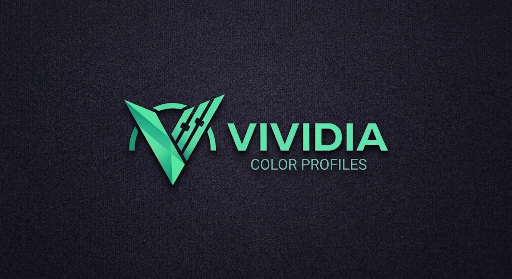
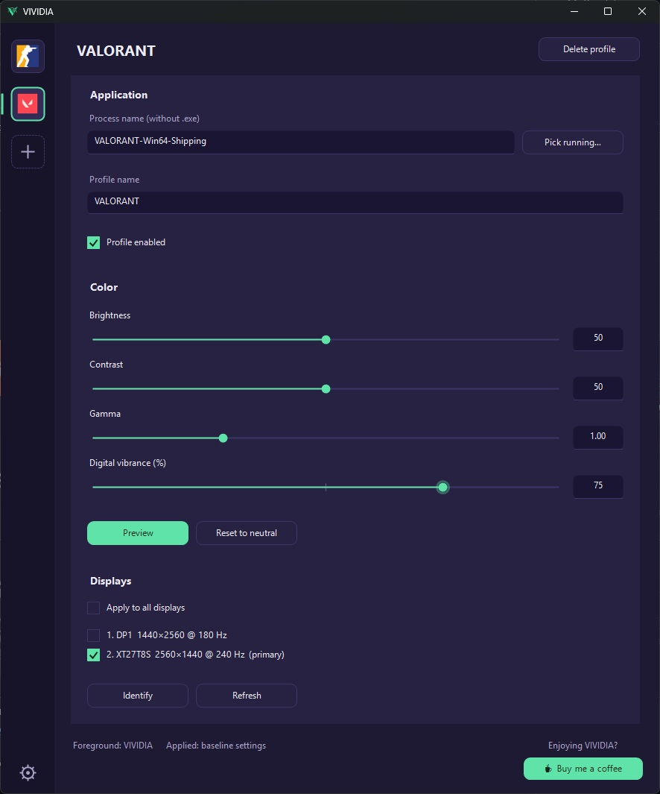

# VIVIDIA

## [**Download latest**](https://github.com/zeddo-dev/VIVIDIA/releases/latest)

## What does it do?

You can set any of the following per application:

1. Brightness
2. Contrast
3. Gamma
4. Digital vibrance (aka Saturation)
5. All displays or only the ones you pick
6. Only affects the display while that application is focused

Light and dark themes, start with Windows and start minimized to tray are in Settings.

## How it works?

- Changes brightness, contrast and gamma through the GPU LUT ([SetDeviceGammaRamp](https://learn.microsoft.com/en-us/windows/win32/api/wingdi/nf-wingdi-setdevicegammaramp))
- Changes digital vibrance through NVAPI (NVIDIA) and ADL (AMD)
- Watches the foreground window, so colors switch the moment you alt-tab
- Your normal colors are saved before the first change and restored when the game closes, so a
  crash cannot leave the screen stuck with a game's gamma

## Supported graphic cards

- Nvidia GPU **supported.** (Brightness/Contrast/Gamma/Vibrance)
- AMD GPU **supported.** (Brightness/Contrast/Gamma/Vibrance)
- Intel **partially supported.** (Except Vibrance)

## How to Use

1. Open the application
2. **Add profile**: type the process name or pick a running application
3. Set the color values. **Preview** shows them live, **Reset to neutral** puts them back
4. Minimize to tray and play
5. Profiles are saved automatically to `%APPDATA%\VIVIDIA`

## Warning

- It does not work while **HDR is on**, because Windows ignores the LUT there
- A game in **exclusive fullscreen** may overwrite the LUT with its own; borderless is safer
- Windows caps the brightness/contrast/gamma range. **Unlock range…** in the app lifts the cap
   (admin rights required). Moderate values work without it
- Vibrance needs an NVIDIA or AMD desktop driver; on Intel that slider does nothing
- Applications are matched by **process name**
- In a **Remote Desktop session** the monitor is virtual and ignores the LUT, so brightness,
   contrast and gamma do nothing there, and the status line says so

## Anti-Cheat Safety

VIVIDIA runs purely as a desktop-level display utility. It does not touch game files or memory.

- **No Code Injection:** VIVIDIA never injects DLLs, hooks DirectX/Vulkan/OpenGL, or attaches to game processes.
- **Official GPU APIs:** Digital vibrance is adjusted using standard vendor APIs (NVIDIA NVAPI and AMD ADL) - the same calls used by NVIDIA Control Panel and AMD Software.
- **Hardware Ramp LUTs:** Gamma, contrast, and brightness are modified via standard Windows display Lookup Tables (Ramp LUTs) at the OS level.
- **Process Detection:** Profile switching only checks active process names to detect when a game is in focus. It does not open handles to read or write game memory.

Because everything happens at the display driver layer outside the game process, it is safe to use alongside common anti-cheats

## Technical details

How the LUT and vibrance are applied, monitor detection through EDID, the Windows gamma limit,
building and diagnostics are covered in [TECHNICAL.md](TECHNICAL.md).

## Licence

MIT, see [LICENSE](LICENSE).
